# InfraAgent

> AI-powered multi-agent platform that converts natural-language infrastructure requests into production-ready, standards-compliant IaC (Bicep & Terraform). Built on Azure AI Foundry.

Built for the **Capgemini Microsoft Global Partner Hackathon 2026** by Terraformers Anonymous.

---

## How It Works

```mermaid
graph LR
    User([User]) -->|natural language| ChatUI[Chat UI]
    ChatUI --> Consulting[Consulting Agent]
    Consulting -->|RequirementsHandoff| CodeGen[CodeGen Agent]

    subgraph Loop1["Review Loop (max 3×)"]
        direction TB
        Validate[IaC Validation]
        Standards[Standards Agent]
        Security[Security Agent]
    end

    CodeGen <-->|findings feedback| Loop1
    Loop1 -->|no errors| H1{H1 Gate}
    H1 -->|approved| PR[PR Workflow]
    PR --> Plan[Plan / What-If]
    Plan --> H2{H2 Gate}
    H2 -->|approved| Deploy[Deploy]
```



| Stage | Description |
|---|---|
| **Chat** | Consulting agent gathers requirements over a conversation |
| **CodeGen** | Generates Bicep (or Terraform) using AVM-first strategy |
| **Validate** | Deterministic CLI lint/fmt check (`az bicep lint`, `terraform validate`) |
| **Standards + Security** | AI review for naming/tagging policies and security posture |
| **H1 Gate** | Human approves generated code before PR creation |
| **PR** | Branch + commit + pull request created on GitHub |
| **Plan** | `az deployment group what-if` or `terraform plan` |
| **H2 Gate** | Human approves the plan before deployment |
| **Deploy** | `az deployment group create` or `terraform apply` |

---

## Prerequisites

| Tool | Min Version | Install |
|---|---|---|
| **Python** | 3.11+ | https://www.python.org/downloads/ |
| **uv** | latest | https://docs.astral.sh/uv/getting-started/installation/ |
| **Node.js** | 20+ | https://nodejs.org/en/download |
| **Azure CLI** | latest | https://learn.microsoft.com/en-us/cli/azure/install-azure-cli |
| **Git** | latest | https://git-scm.com/downloads |

---

## 1. Clone & Install

```bash
git clone https://github.com/Jamil100/InfraAgent.git
cd InfraAgent

# Backend
cd backend && uv sync

# Frontend
cd ../frontend && npm install
```

---

## 2. Configure Environment

```bash
# From the repo root
cp .env.example .env        # macOS / Linux
Copy-Item .env.example .env  # Windows PowerShell
```

Open `.env` and fill in the values below.

### Required

```env
# Azure AI Foundry — ai.azure.com → your project → Overview → Project endpoint
PROJECT_ENDPOINT=https://<hub>.services.ai.azure.com/api/projects/<project>
MODEL_DEPLOYMENT_NAME=azureml://registries/azure-openai/models/gpt-5.4-mini/versions/2026-03-17

# Azure — az account show
AZURE_SUBSCRIPTION_ID=xxxxxxxx-xxxx-xxxx-xxxx-xxxxxxxxxxxx
AZURE_TENANT_ID=xxxxxxxx-xxxx-xxxx-xxxx-xxxxxxxxxxxx

# GitHub PAT — github.com/settings/tokens (Contents + Pull requests: read/write)
GITHUB_TOKEN=github_pat_xxxxxxxxxxxx
GITHUB_REPO_OWNER=Jamil100
GITHUB_REPO_NAME=InfraAgent
GITHUB_TARGET_BRANCH=main
```

### Optional

```env
# MCP servers — leave blank to skip tool grounding
MCP_BICEP_URL=http://localhost:5007/mcp
MCP_TERRAFORM_URL=http://localhost:8080/mcp
MCP_AZURE_URL=http://localhost:5009/mcp

# Deploy stage — leave blank to stop the pipeline at PR creation
DEPLOY_RESOURCE_GROUP=rg-infraagent-dev
DEPLOY_LOCATION=eastus
```

> **Full credential guide** — where to find each value, required role assignments, and GitHub token setup:
> → [LOCAL_DEV.md § Configure Credentials](LOCAL_DEV.md#3-configure-credentials--environment-variables)

---

## 3. Authenticate with Azure

```bash
az login
az account set --subscription <your-subscription-id>
```

The backend uses `DefaultAzureCredential` — no client secrets needed for local dev.

**Required roles:**

| Role | Scope |
|---|---|
| Azure AI Developer | Foundry resource |
| Reader | Subscription |
| Contributor | Target resource group *(only if deploy stage enabled)* |

---

## 4. Run Locally

Open two terminals:

```bash
# Terminal 1 — Backend (http://localhost:8000)
cd backend
uv run uvicorn main:app --reload --port 8000

# Terminal 2 — Frontend (http://localhost:3000)
cd frontend
npm run dev
```

Verify the backend is up:

```bash
curl http://localhost:8000/health
# {"status":"ok","version":"0.1.0"}
```

Open **http://localhost:3000** — you should see the InfraAgent chat interface.

---

## 5. Test the Pipeline

1. **Chat** — type a request (e.g. *"I need a VNet with 3 subnets and a Key Vault in West Europe"*)
2. **Iterate** — answer the Consulting agent's clarifying questions until the **Launch Pipeline** button activates
3. **Launch** — click the button; the pipeline monitor page opens and stages advance in real time
4. **H1 Gate** — approve the generated code when prompted
5. **PR** — a pull request appears in your GitHub repo with all generated IaC files
6. **H2 Gate** — review the plan output and approve to trigger deployment *(if `DEPLOY_RESOURCE_GROUP` is set)*

### Run the test suite

```bash
cd backend
uv sync --extra dev
uv run pytest -v --tb=short
```

See [docs/testing.md](docs/testing.md) for the full testing strategy including agent mock tests and API integration tests.

---

## 6. API Reference

| Method | Endpoint | Description |
|---|---|---|
| `GET` | `/health` | Health check |
| `POST` | `/api/chat` | Chat with the Consulting agent (multi-turn) |
| `POST` | `/api/pipeline/start` | Start the pipeline (returns immediately; poll for status) |
| `GET` | `/api/pipeline/status/{id}` | Poll pipeline stage, findings, PR URL, plan output |
| `POST` | `/api/pipeline/approve/h1` | Approve / reject the H1 code review gate |
| `POST` | `/api/pipeline/approve/h2` | Approve / reject the H2 plan review gate |

Interactive docs (auto-generated): **http://localhost:8000/docs**

Full reference: [docs/api-reference.md](docs/api-reference.md)

---

## Project Structure

```
backend/src/
├── config.py              # Settings from env vars
├── core/
│   ├── models.py          # Domain models (PipelineState, RequirementsHandoff…)
│   └── ports.py           # Port interfaces (ABCs)
├── agents/
│   ├── factory.py         # Foundry agent creation + MCP tool wiring
│   ├── consulting.py      # Consulting agent adapter
│   ├── codegen.py         # CodeGen agent adapter
│   ├── reviewers.py       # Standards + Security agent adapters
│   └── prompts/           # System prompts (markdown)
├── adapters/
│   ├── github_adapter.py            # GitHub REST API (branch/commit/PR)
│   ├── iac_validation_adapter.py    # az bicep lint + terraform validate
│   ├── subscription_discovery_adapter.py  # Azure resource discovery
│   └── deploy_adapter.py           # Bicep what-if/deploy + Terraform plan/apply
├── services/
│   └── pipeline.py        # OrchestratorPipeline (async generator)
└── api/
    ├── routes.py          # FastAPI routes
    └── dependencies.py    # DI (Foundry client singleton)

frontend/
├── app/
│   ├── page.tsx                    # Chat interface
│   └── pipeline/[sessionId]/      # Pipeline monitor + approval gates
├── components/
│   ├── ChatWindow.tsx
│   ├── PipelineStatus.tsx
│   ├── FileViewer.tsx
│   └── ApprovalGate.tsx
└── lib/api.ts                      # Typed API client
```

---

## Tech Stack

| Layer | Technology |
|---|---|
| **AI Platform** | Azure AI Foundry Agent Service |
| **Model** | gpt-5.4-mini (`azureml://registries/azure-openai/models/gpt-5.4-mini/versions/2026-03-17`) |
| **Backend** | Python 3.11+ · FastAPI · uvicorn |
| **Frontend** | Next.js 15 · React 19 · TypeScript · Tailwind CSS |
| **IaC** | Bicep (primary) · Terraform (secondary) |
| **MCP Servers** | Bicep MCP · Terraform MCP · Azure MCP |
| **Source Control** | GitHub REST API |
| **Auth** | `DefaultAzureCredential` (azure-identity) |
| **Deps** | uv · npm |

---

## Documentation

| Doc | Contents |
|---|---|
| [LOCAL_DEV.md](LOCAL_DEV.md) | Full local setup guide with credential walkthrough |
| [docs/architecture.md](docs/architecture.md) | System design, pipeline stages, ports & adapters |
| [docs/api-reference.md](docs/api-reference.md) | All endpoints with request/response schemas |
| [docs/agents.md](docs/agents.md) | Agent design, MCP wiring, how to add a new agent |
| [docs/setup.md](docs/setup.md) | Dev environment setup (extended) |
| [docs/testing.md](docs/testing.md) | Testing strategy and example test cases |
| [docs/mcp-servers.md](docs/mcp-servers.md) | MCP server configuration |
| [docs/deployment.md](docs/deployment.md) | **Cloud deployment** — Docker → ACR → Foundry → ACA |
| [docs/decisions/](docs/decisions/) | Architecture Decision Records (ADRs) |

---

## License

Apache 2.0 — see [LICENSE](LICENSE)
