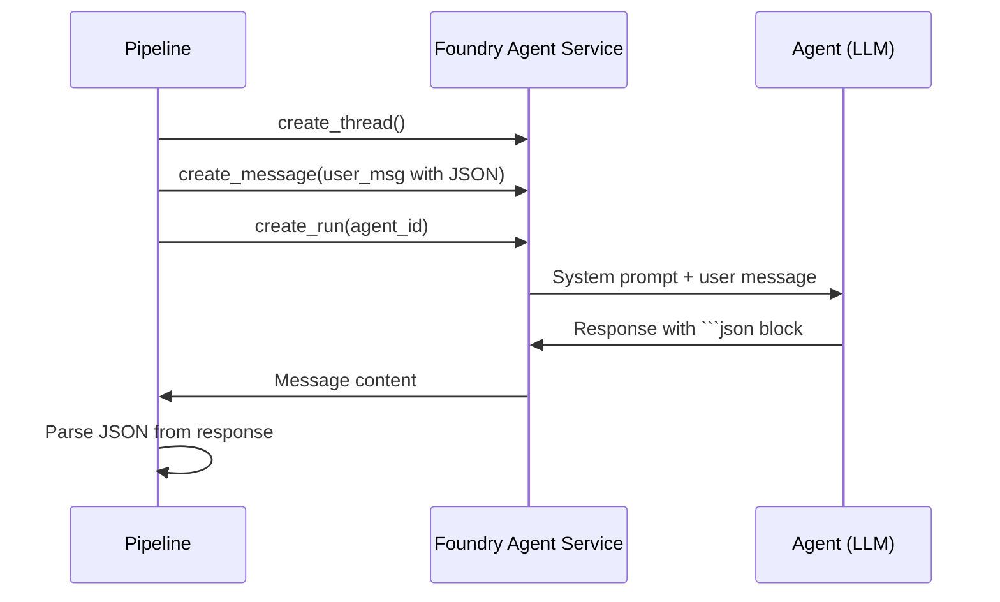

# Agent Design Guide

## Overview

InfraAgent uses **eight Foundry-hosted agents** coordinated by an orchestrator — LLM-powered agents managed by Azure AI Foundry Agent Service. Each agent has a markdown system prompt, a ModelRouter task profile, MCP tool bindings, and returns structured JSON output. A ninth pipeline component — the **IaC Validation Pipeline** — is deterministic (no LLM) and runs as a function tool chain between CodeGen and Standards.

## ModelRouter Task Profiles

All agents use the **Azure AI Foundry ModelRouter** for model selection. Rather than hardcoding specific models, each agent declares a task profile. ModelRouter routes requests to the optimal model in the Foundry model catalog based on cost, capability, and availability.

| Profile | Primary Candidate | Fallback Candidates | Used By |
|---|---|---|---|
| `complex-reasoning` | GPT-4o | GPT-4.1 | Consulting, Deploy, Template Curation |
| `code-generation` | GPT-4o | Claude 3.5 Sonnet (via Foundry catalog) | CodeGen, Template Curation |
| `analysis` | GPT-4o-mini | GPT-4o | Standards |
| `fast-lightweight` | GPT-4o-mini | Phi-4 | Security, PR Workflow, Diagram generation |
| `orchestration` | GPT-4o | GPT-4o-mini | Orchestrator, Deploy |

ModelRouter automatically handles retries across candidates if the primary model is unavailable or rate-limited. Configuration is at the Foundry project level — code references `MODEL_DEPLOYMENT_NAME` from environment config, which can point to a ModelRouter endpoint.

## Agent Communication Pattern



All agents follow this pattern:
1. Pipeline creates a **thread** (conversation context)
2. Pipeline sends a **user message** containing structured JSON input
3. Agent responds with a **markdown-fenced JSON block** (`\`\`\`json ... \`\`\``)
4. Pipeline **parses the JSON** into the appropriate Pydantic model

## Agent Roster

### Orchestrator
- **ModelRouter Profile**: `orchestration`
- **Role**: Routes requests, manages agent lifecycle, shares context, enforces pipeline sequence
- **Implementation**: `backend/src/infrastructure/agents/orchestrator.py`
- **Tools**: Agent-to-agent handoff (Microsoft Agent Framework graph workflow API)
- **Key behavior**: Manages two workflows — chat path (full pipeline) and catalog path (template fast-path). Enforces maker-checker loops (max 3 iterations for Loop 1, max 2 for Loop 2). Invokes the IaC Validation Pipeline as a deterministic function tool between CodeGen and Standards.

### Consulting Agent
- **ModelRouter Profile**: `complex-reasoning`
- **Prompt**: `backend/src/agents/prompts/consulting.md`
- **Implementation**: `backend/src/agents/consulting.py`
- **MCP Servers**: Azure MCP
- **Input**: Free-text user message
- **Output**: `RequirementsHandoff` JSON when requirements are clear; clarifying questions otherwise
- **Stateful**: Maintains a conversation thread across multiple chat turns
- **Key behaviors**:
  - **Project type classification**: Classifies the request as Demo/Learning, Production, Enterprise, or Regulated. Outputs `[PROJECT_TYPE:PRODUCTION]` (or appropriate type). This determines WAF pillar depth and requirements gathering intensity.
  - **Azure subscription discovery**: Connects to the target Azure subscription via Azure MCP Server to inventory existing resource groups, VNets, subnets, naming patterns, quotas, and Terraform state backends. Surfaces findings conversationally ("I can see you already have a VNet `vnet-prod-westeurope` with subnets...") and passes them as structured constraints to CodeGen.
  - **Knowledge wiki search**: Checks the knowledge wiki for matching templates after every user response. If a match is found, outputs `[RECOMMEND_TEMPLATE:template-name]` and suggests the catalog path.
  - **Domain skills**: Loads pluggable domain skill markdown files (from `knowledge-wiki/skills/`) that inject domain-specific questions, patterns, and readiness checklists.
  - **Requirements handoff**: When requirements are complete, outputs `[REQUIREMENTS_COMPLETE]` and produces a structured handoff document consumed by CodeGen.

### CodeGen Agent
- **ModelRouter Profile**: `code-generation`
- **Prompt**: `backend/src/agents/prompts/codegen.md` (Terraform variant: `codegen_terraform.md`)
- **Implementation**: `backend/src/agents/codegen.py`
- **Port**: `ICodeGenPort`
- **MCP Servers**: Terraform MCP, Bicep MCP, Azure MCP
- **Input**: `RequirementsHandoff` JSON + optional `ValidationFinding[]` feedback + optional subscription context
- **Output**: `CodeGenOutput` JSON (files array + Mermaid diagram + explanation)
- **Key behaviors**:
  - **AVM-first module strategy**: MUST prefer Azure Verified Modules (AVM) over raw resource declarations for any resource where an AVM module exists. For Terraform: `source = "Azure/avm-res-{service}-{resource}/azurerm"`. For Bicep: `br/public:avm/res/{service}/{resource}:{version}`. Always checks AVM availability via MCP tools before writing raw resources.
  - **Secret handling**: Never hardcodes secrets. Uses Key Vault references, `sensitive = true` (Terraform) or `@secure()` (Bicep) on variables, Managed Identity for auth, and never outputs sensitive values.
  - **File structure conventions**: Produces consistent file layouts. Terraform: `main.tf`, `variables.tf`, `outputs.tf`, `terraform.tf`, `locals.tf`, `environments/*.tfvars`. Bicep: `main.bicep`, `main.bicepparam`, `modules/*.bicep`.
  - **Architecture diagram generation**: Produces a Mermaid diagram definition alongside the IaC code, showing resource groups, networking topology, compute resources, data services, and their relationships.
  - **Subscription context awareness**: When subscription context is provided, uses existing resources via `data` sources (Terraform) or `existing` keyword (Bicep) and avoids CIDR conflicts with existing VNets.

### Standards Agent
- **ModelRouter Profile**: `analysis`
- **Prompt**: `backend/src/agents/prompts/standards.md`
- **Implementation**: `backend/src/agents/reviewers.py` (`StandardsAgent`)
- **Port**: `IStandardsPort`
- **MCP Servers**: GitHub MCP (for policy repo access)
- **Input**: `GeneratedFile[]` JSON
- **Output**: `ValidationFinding[]` JSON
- **Checks**: Naming conventions, required tags, module structure, parameter hygiene, output completeness, file structure validation (Section 7.1.3.2 of PRD), AVM compliance (flags raw resources when an AVM module exists), dependency correctness (detects redundant `depends_on` declarations)

### Security Agent
- **ModelRouter Profile**: `fast-lightweight`
- **Prompt**: `backend/src/agents/prompts/security.md`
- **Implementation**: `backend/src/agents/reviewers.py` (`SecurityAgent`)
- **Port**: `ISecurityPort`
- **MCP Servers**: None (uses function tools)
- **Function Tools**: `run_tfsec` (Terraform static analysis), `run_checkov` (policy scan on IaC files)
- **Input**: `GeneratedFile[]` JSON
- **Output**: `ValidationFinding[]` JSON
- **Checks**: Public exposure, encryption at rest, managed identities, secrets management, NSG rules, TLS 1.2+, HTTPS enforcement, managed disks

### PR Workflow Agent
- **ModelRouter Profile**: `fast-lightweight`
- **Prompt**: `backend/src/agents/prompts/pr_workflow.md`
- **Implementation**: `backend/src/agents/pr_workflow.py`
- **Port**: `ISourceControlPort`
- **MCP Servers**: GitHub MCP
- **Input**: Generated files + deployment metadata
- **Output**: PR URL, branch name, commit SHA
- **Key behaviors**:
  - Creates a feature branch and commits all generated IaC files atomically
  - Opens a Pull Request with structured description (resources created, standards applied, security scan results)
  - Commits the auto-generated architecture diagram (SVG) to `/docs/architecture/` in the repo
  - Connects to GitHub Actions via GitHub MCP Server to monitor CI/CD pipeline status

### Deploy Agent
- **ModelRouter Profile**: `complex-reasoning` (for error interpretation) / `orchestration` (for coordination)
- **Prompt**: `backend/src/agents/prompts/deploy.md`
- **Implementation**: `backend/src/agents/deploy.py`
- **Port**: `IDeployPort`
- **MCP Servers**: GitHub MCP, Azure MCP
- **Input**: PR reference + deployment configuration
- **Output**: Plan output, apply output, deployment status
- **Key behaviors**:
  - Triggers `terraform plan` or `bicep what-if` via GitHub Actions CI/CD
  - **Set Diff Analysis (P1, Terraform)**: Optionally filters false-positive diffs caused by AzureRM Set-type attribute reordering. Categorizes changes as: 🟢 order-only, 🟡 actual Set changes, 🔴 resource replacement.
  - Surfaces plan output to the user for Human Gate H2 review
  - On approval, triggers `terraform apply` or `az deployment create`
  - **Plan-failure rework (Loop 2)**: On plan failure, extracts the full error output, categorizes the failure (resource conflict, SKU unavailability, quota exceeded, auth failure, provider mismatch, module error), and routes back to CodeGen for rework (max 2 iterations). Non-fixable errors (quota, auth) are escalated to the user.

### Template Curation Agent (P1 — Stretch)
- **ModelRouter Profile**: `complex-reasoning`
- **Prompt**: `backend/src/agents/prompts/template_curation.md`
- **Implementation**: `backend/src/agents/template_curation.py`
- **MCP Servers**: GitHub MCP
- **Input**: Successfully deployed IaC code + deployment metadata
- **Output**: Generalized template + metadata.yaml + PR to knowledge wiki repo
- **Key behaviors**:
  - Post-deploy analysis: checks novelty against existing wiki templates
  - Generalizes hardcoded values into parameters
  - Proposes a new template via PR to the knowledge wiki repo (separate from InfraAgent repo)
  - Subject to Human Gate H3 approval by a platform engineer

## IaC Validation Pipeline (Non-Agent)

The IaC Validation Pipeline is a **deterministic, non-LLM step** that runs between CodeGen output and the Standards Agent. It validates that generated code compiles, parses, and conforms to formatting standards before any policy or security review. This is not an agent — it is a function tool chain invoked directly by the Orchestrator.

**Terraform validation chain:**

| Step | Tool | Blocking? | On Failure |
|---|---|---|---|
| 1 | `terraform fmt -check` | No | Auto-fix with `terraform fmt` (no CodeGen rework needed) |
| 2 | `terraform init` | Yes | Feed error to CodeGen (likely bad module source or version pin) |
| 3 | `terraform validate` | Yes | Feed structured errors to CodeGen for rework |
| 4 | `tflint` (stretch) | No | Warnings are informational, attached to H1 review |

**Bicep validation chain:**

| Step | Tool | Blocking? | On Failure |
|---|---|---|---|
| 1 | `bicep build --stdout --no-restore` | Yes | Feed compilation errors to CodeGen for rework |
| 2 | `bicep format` | No | Auto-format (non-blocking) |
| 3 | `bicep lint` | Conditional | Errors → feed to CodeGen. Warnings triaged per PRD rules |

**Catalog path behavior:** Hydrated templates run only Steps 1–3 (Terraform) or Steps 1–2 (Bicep). tflint/lint are skipped because templates are pre-validated.

Validation failures feed back to CodeGen as part of Loop 1 (shared retry counter across validation, standards, and security: 3 iterations total).

## Pipeline Flows

### Chat Path (Custom Pipeline)

```
Consulting → Subscription Discovery → CodeGen → IaC Validation → Standards → Security → Diagram → H1 → PR → Plan → H2 → Deploy
```

With maker-checker Loop 1 on CodeGen/IaCValidation/Standards/Security (max 3×) and plan-failure Loop 2 (max 2×).

### Catalog Path (Template Deployment)

```
Template Hydrate → IaC Validation → H1 → PR → Plan → H2 → Deploy
```

Skips consulting, iterative codegen, standards, and security loops (templates are pre-validated).

## MCP Tool Mapping

| Agent | MCP Servers |
|---|---|
| Orchestrator | None (agent-to-agent handoff) |
| Consulting | Azure MCP |
| CodeGen | Terraform MCP, Bicep MCP, Azure MCP |
| Standards | GitHub MCP |
| Security | None (function tools: tfsec, Checkov) |
| PR Workflow | GitHub MCP |
| Deploy | GitHub MCP, Azure MCP |
| Template Curation | GitHub MCP |

## How to Add a New Agent

### Step 1: Create the System Prompt

Create `backend/src/agents/prompts/<agent-name>.md`:

```markdown
You are InfraAgent's **<Agent Name>** — <one-line role description>.

## Role
<What this agent does>

## Output Format
Return a JSON block fenced with ` ```json ... ``` `:
```json
{
  "key": "value"
}
```
```

**Prompt design rules**:
- Start with role declaration
- Define explicit output schema
- Provide examples where helpful
- Include quality rules (what NOT to do)
- Keep prompts under 500 words

### Step 2: Define the Port Interface (if new)

Add to `backend/src/core/ports.py`:

```python
class INewPort(ABC):
    """One-line description of what this port does."""

    @abstractmethod
    async def do_something(self, input_data: SomeModel) -> SomeOutput:
        ...
```

### Step 3: Create the Agent Implementation

Create `backend/src/agents/<agent_name>.py`:

```python
from src.core.ports import INewPort

class NewAgent(INewPort):
    def __init__(self, client: AIProjectClient, agent: Agent) -> None:
        self._client = client
        self._agent = agent

    async def do_something(self, input_data: SomeModel) -> SomeOutput:
        thread = await self._client.agents.create_thread()

        # Build user message with JSON input
        user_msg = f"```json\n{input_data.model_dump_json(indent=2)}\n```"

        await self._client.agents.create_message(
            thread_id=thread.id,
            role=MessageRole.USER,
            content=user_msg,
        )

        run = await self._client.agents.create_run(
            thread_id=thread.id,
            agent_id=self._agent.id,
        )

        # Poll + parse (follow pattern from codegen.py)
        ...
```

### Step 4: Wire into the Pipeline

In `backend/src/services/pipeline.py`, add the new agent to `OrchestratorPipeline.__init__()` and call it at the appropriate stage.

In `backend/src/api/routes.py`, create the agent via `factory.py` and pass it to the pipeline.

### Step 5: Register the Agent Name and MCP Servers

The agent name must match the prompt filename. `create_agent(client, "new-agent")` will load `prompts/new-agent.md`.

Add MCP server mappings to `_AGENT_MCP_SERVERS` in `backend/src/agents/factory.py`. Set the corresponding `MCP_*_URL` environment variable.

## MCP Tool Auto-Wiring

Foundry agents can be equipped with **MCP (Model Context Protocol) tool servers** that give them real-time access to Azure resources, Bicep documentation, Terraform provider schemas, and GitHub operations. Tool attachment is automatic — no code changes needed.

### How it Works

`backend/src/agents/factory.py` defines a mapping (`_AGENT_MCP_SERVERS`) specifying which MCP servers each agent should receive (see MCP Tool Mapping table above).

When `create_agent()` is called, `_build_mcp_tools(agent_name)` reads the corresponding env vars. For each configured URL, it creates an `McpTool` and attaches it to the agent. If an env var is empty or `McpTool` is not available in the installed SDK version, the agent is created without that tool (graceful degradation — a warning is logged).

### Configuration

Set these env vars to enable MCP tools (leave blank to disable):

```env
MCP_BICEP_URL=http://localhost:5007/mcp
MCP_TERRAFORM_URL=http://localhost:5008/mcp
MCP_AZURE_URL=http://localhost:5009/mcp
MCP_GITHUB_URL=http://localhost:5010/mcp
```

See [setup.md](setup.md) and [mcp-servers.md](mcp-servers.md) for instructions on starting each MCP server.

## Prompt Iteration Workflow

Use the AI Toolkit to iterate on prompts before deploying:

1. **Model Playground**: Paste the system prompt, send test inputs, refine the prompt
2. **Agent Inspector**: Connect to a running agent's thread, inspect conversation history and JSON output
3. **Local testing**: Run the backend locally, use `/api/chat` to test Consulting agent, `/api/pipeline/start` to test the full pipeline

## Design Principles

1. **Structured JSON contracts** — Agents return JSON in markdown fences, parsed into Pydantic models. This makes agent output deterministic and testable.

2. **Single responsibility** — Each agent has exactly one job. The pipeline orchestrates their interaction.

3. **ModelRouter-first** — Agents declare task intent via profiles, not model names. ModelRouter handles selection, failover, and cost optimization transparently.

4. **Feedback loops** — When review agents or the IaC Validation Pipeline find errors, findings are fed back to CodeGen as structured input. The LLM sees exactly what failed and why.

5. **Deterministic before LLM** — The IaC Validation Pipeline (fmt/validate/lint) runs before any LLM-based review, catching compilation errors cheaply before they consume LLM tokens.

6. **Stateless per-run** — Agents don't persist state between pipeline runs. Thread history is managed by Foundry.

7. **Port abstraction** — Every agent implements a port interface. The pipeline depends on ports, not concrete agents. You can swap a Foundry-hosted agent for a local mock in tests.