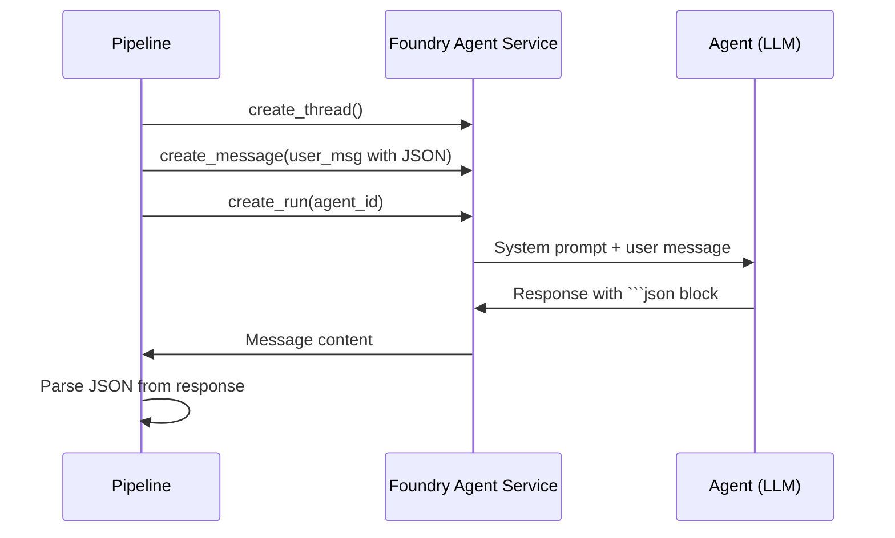

# Agent Design Guide

## Overview

InfraAgent uses **Foundry-hosted agents** — LLM-powered agents managed by Azure AI Foundry Agent Service. Each agent has a markdown system prompt, receives structured input, and returns structured JSON output.

## Agent Communication Pattern



All agents follow this pattern:
1. Pipeline creates a **thread** (conversation context)
2. Pipeline sends a **user message** containing structured JSON input
3. Agent responds with a **markdown-fenced JSON block** (`\`\`\`json ... \`\`\``)
4. Pipeline **parses the JSON** into the appropriate Pydantic model

## Current Agents

### Consulting Agent
- **Prompt**: `backend/src/agents/prompts/consulting.md`
- **Implementation**: `backend/src/agents/consulting.py`
- **Input**: Free-text user message
- **Output**: `RequirementsHandoff` JSON when requirements are clear; clarifying questions otherwise
- **Stateful**: Maintains a conversation thread across multiple chat turns

### CodeGen Agent
- **Prompt**: `backend/src/agents/prompts/codegen.md`
- **Implementation**: `backend/src/agents/codegen.py`
- **Port**: `ICodeGenPort`
- **Input**: `RequirementsHandoff` JSON + optional `ValidationFinding[]` feedback
- **Output**: `CodeGenOutput` JSON (files array + Mermaid diagram + explanation)
- **Key behavior**: AVM-first Bicep generation, parameterized names, required tags, Key Vault for secrets

### Standards Agent
- **Prompt**: `backend/src/agents/prompts/standards.md`
- **Implementation**: `backend/src/agents/reviewers.py` (`StandardsAgent`)
- **Port**: `IStandardsPort`
- **Input**: `GeneratedFile[]` JSON
- **Output**: `ValidationFinding[]` JSON
- **Checks**: Naming conventions, required tags, module structure, parameter hygiene, output completeness

### Security Agent
- **Prompt**: `backend/src/agents/prompts/security.md`
- **Implementation**: `backend/src/agents/reviewers.py` (`SecurityAgent`)
- **Port**: `ISecurityPort`
- **Input**: `GeneratedFile[]` JSON
- **Output**: `ValidationFinding[]` JSON
- **Checks**: Public exposure, encryption, managed identities, secrets management, NSG rules, TLS 1.2+

## How to Add a New Agent

### Step 1: Create the System Prompt

Create `backend/src/agents/prompts/<agent-name>.md`:

```markdown
You are InfraAgent's **<Agent Name>** — <one-line role description>.

## Role
<What this agent does>

## Output Format
Return a JSON block fenced with ` ```json ... ``` `:
```json
{
  "key": "value"
}
```
```

**Prompt design rules**:
- Start with role declaration
- Define explicit output schema
- Provide examples where helpful
- Include quality rules (what NOT to do)
- Keep prompts under 500 words

### Step 2: Define the Port Interface (if new)

Add to `backend/src/core/ports.py`:

```python
class INewPort(ABC):
    """One-line description of what this port does."""

    @abstractmethod
    async def do_something(self, input_data: SomeModel) -> SomeOutput:
        ...
```

### Step 3: Create the Agent Implementation

Create `backend/src/agents/<agent_name>.py`:

```python
from src.core.ports import INewPort

class NewAgent(INewPort):
    def __init__(self, client: AIProjectClient, agent: Agent) -> None:
        self._client = client
        self._agent = agent

    async def do_something(self, input_data: SomeModel) -> SomeOutput:
        thread = await self._client.agents.create_thread()

        # Build user message with JSON input
        user_msg = f"```json\n{input_data.model_dump_json(indent=2)}\n```"

        await self._client.agents.create_message(
            thread_id=thread.id,
            role=MessageRole.USER,
            content=user_msg,
        )

        run = await self._client.agents.create_run(
            thread_id=thread.id,
            agent_id=self._agent.id,
        )

        # Poll + parse (follow pattern from codegen.py)
        ...
```

### Step 4: Wire into the Pipeline

In `backend/src/services/pipeline.py`, add the new agent to `OrchestratorPipeline.__init__()` and call it at the appropriate stage.

In `backend/src/api/routes.py`, create the agent via `factory.py` and pass it to the pipeline.

### Step 5: Register the Agent Name

The agent name must match the prompt filename. `create_agent(client, "new-agent")` will load `prompts/new-agent.md`.

## Prompt Iteration Workflow

Use the AI Toolkit to iterate on prompts before deploying:

1. **Model Playground**: Paste the system prompt, send test inputs, refine the prompt
2. **Agent Inspector**: Connect to a running agent's thread, inspect conversation history and JSON output
3. **Local testing**: Run the backend locally, use `/api/chat` to test Consulting agent, `/api/pipeline/start` to test the full pipeline

## MCP Tool Auto-Wiring

Foundry agents can be equipped with **MCP (Model Context Protocol) tool servers** that give them real-time access to Azure resources, Bicep documentation, and Terraform provider schemas. Tool attachment is automatic — no code changes needed.

### How it Works

`backend/src/agents/factory.py` defines a mapping (`_AGENT_MCP_SERVERS`) specifying which MCP servers each agent should receive:

| Agent | MCP Servers |
|---|---|
| `codegen` | Bicep MCP, Terraform MCP, Azure MCP |
| `standards` | Bicep MCP, Azure MCP |
| `security` | Bicep MCP, Terraform MCP |
| `consulting` | Azure MCP |

When `create_agent()` is called, `_build_mcp_tools(agent_name)` reads the corresponding env vars. For each configured URL, it creates an `McpTool` and attaches it to the agent. If an env var is empty or `McpTool` is not available in the installed SDK version, the agent is created without that tool (graceful degradation — a warning is logged).

### Configuration

Set these env vars to enable MCP tools (leave blank to disable):

```env
MCP_BICEP_URL=http://localhost:5007/mcp
MCP_TERRAFORM_URL=http://localhost:5008/mcp
MCP_AZURE_URL=http://localhost:5009/mcp
```

See [setup.md](setup.md) and [mcp-servers.md](mcp-servers.md) for instructions on starting each MCP server.

---


1. **Structured JSON contracts** — Agents return JSON in markdown fences, parsed into Pydantic models. This makes agent output deterministic and testable.

2. **Single responsibility** — Each agent has exactly one job. The pipeline orchestrates their interaction.

3. **Feedback loops** — When review agents find errors, findings are fed back to CodeGen as structured input. The LLM sees exactly what failed and why.

4. **Stateless per-run** — Agents don't persist state between pipeline runs. Thread history is managed by Foundry.

5. **Port abstraction** — Every agent implements a port interface. The pipeline depends on ports, not concrete agents. You can swap a Foundry-hosted agent for a local mock in tests.
